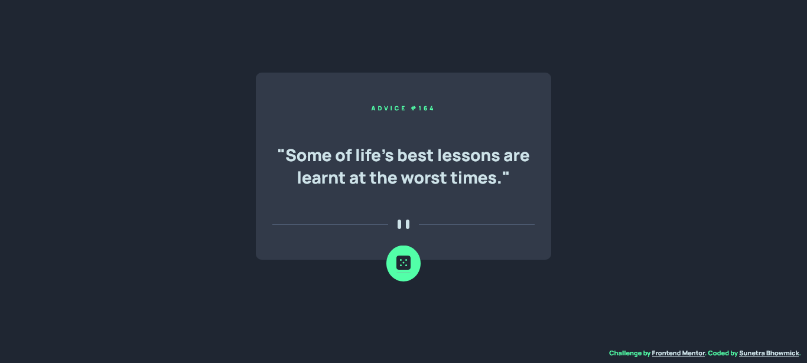

# Frontend Mentor - Advice generator app solution

This is a solution to the [Advice generator app challenge on Frontend Mentor](https://www.frontendmentor.io/challenges/advice-generator-app-QdUG-13db). Frontend Mentor challenges help you improve your coding skills by building realistic projects.

## Table of contents

- [Overview](#overview)
  - [The challenge](#the-challenge)
  - [Screenshot](#screenshot)
  - [Links](#links)
- [My process](#my-process)
  - [Built with](#built-with)
  - [What I learned](#what-i-learned)
  - [Useful resources](#useful-resources)
- [Author](#author)

## Overview

### The challenge

Users should be able to:

- View the optimal layout for the app depending on their device's screen size
- See hover states for all interactive elements on the page
- Generate a new piece of advice by clicking the dice icon

### Screenshot



### Links

- Solution URL: [GitHub](https://github.com/kaiser-sb/advice-generator-app.git)
- Live Site URL: [Advice Generator App](https://kaiser-sb.github.io/advice-generator-app/)

## My process

### Built with

- Semantic HTML5 markup
- CSS
- Flexbox
- Fetch API
- Mobile-first workflow
- Responsive web designing

### What I learned

This is the first Frontend Mentor project where I've used Fetch API for the first time. Handling JSON data is always fun and very useful to learn. I was at first stuck, being unable to store the fetch data in any external variable due to the delay in the `Promise` being resolved. The I decided to write the JSON handling part seperately in a fucntion, and use it directly with `fetch` API. This works great and lessens the amount of code to write as well.

- The JSON handling fucntion

```js
  function populateAdvice(json) {
      loader.style.display = "none"
      id.innerHTML = json.slip.id;
      text.innerHTML = `"${json.slip.advice}"`;
  }
```

- The Fetch API handling

```js
  fetch(apiUrl)
      .then(response => response.json())
      .then(data => populateAdvice(data))
      .catch(error => console.error('Some error has occured', error));
```

### Useful resources

- [W3 Schools](https://www.w3schools.com/jsref/api_fetch.asp) - This is a very easy and concise introduction on how to work with Fetch API. I'd recommend it to anyone who is handling API for the first time or still learning this concept.

## Author

- GitHub - [@kaiser-sb](https://github.com/kaiser-sb)
- Frontend Mentor - [@kaiser-sb](https://www.frontendmentor.io/profile/kaiser-sb)
- LinkedIn - [@yourusername](https://www.linkedin.com/in/kaiser-sb/)
